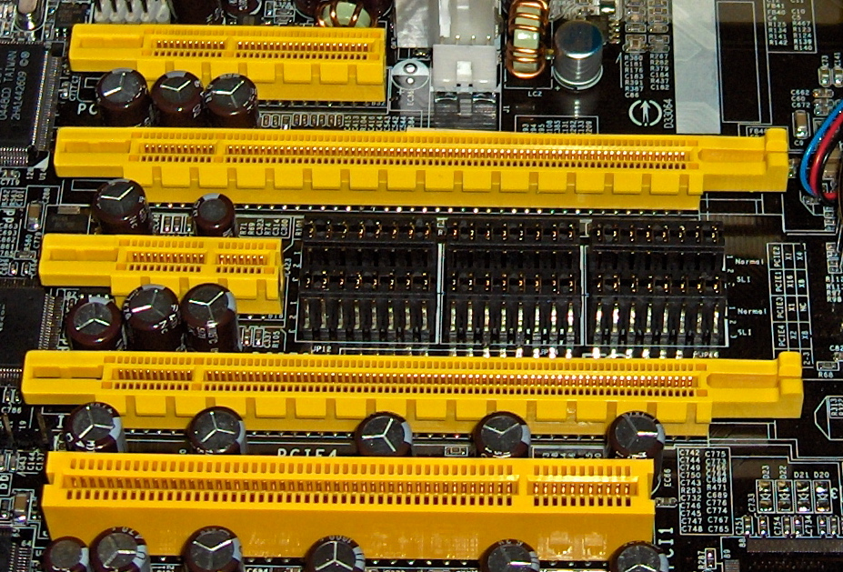
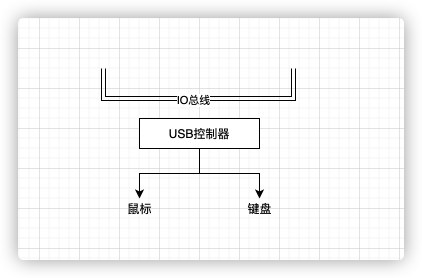

# 1.3 系统的硬件组成

1. [1.3 系统的硬件组成](#13-系统的硬件组成)
    1. [总线(Bus)](#总线bus)
    2. [I/O 设备](#io-设备)
    3. [主存](#主存)
    4. [处理器(CPU)](#处理器cpu)
        1. [四种操作](#四种操作)

## 总线(Bus)

贯穿整个系统的一组电子管道，称为总线,它携带信息字节并负责在各个部件间传递

## I/O 设备

I/O 设备是系统与外部世界的联系通道。常见的 IO 设备有：作为用户输入的键盘和鼠标，作为用户输出的显示器，还有用于出藏起存储数据的磁盘。

每个 I/O 设备都通过一个*控制器或者适配器*与 I/O 总线相连。

控制器和适配器的区别主要在于它们的封装方式：控制器是 I/O 设备本身或者系统主板上的芯片组，而适配器是一块插在主板插槽上的卡，**但无论如何，它们的功能都是在 I/O 设备和 I/O 总线之间传递信息。**

## 主存

主存是一个临时存储设备，在处理器执行程序的时候，用来存放程序和程序处理的数据

从物理上来说，主存是由一组**动态随机存储器（DRAM）芯片组成的**

从逻辑上来说，存储器是一个线性的字节数组，每个字节都有其唯一的地址（数组索引）。

## 处理器(CPU)

中央处理单元(CPU)，简称处理器，是解释存储在主存中指令的引擎。

处理器的核心是一个大小为一个字的存储设备（寄存器），称为**程序计数器(PC)**,PC 在任何时候都指向主存中某条机器语言指令（含有该指令的地址）

**PC 执行逻辑**：PC 一直指向下一条即将执行的指令的地址。处理器从 PC 指向的内存处读取指令，解释指令中的位，执行该指令操作，更新 PC 指向下一个指令

**ALU（算术逻辑运算单元）**： ALU 计算一些数据和地址的值

**寄存器**：是中央处理器内用来暂存指令、数据和地址的电脑存储器

### 四种操作

加载:从主存复制一个字节或者一个字到寄存器，覆盖寄存器原来的内容

存储：从寄存器复制一个字节或者一个字到主存的某一位置
操作：把两个寄存器的内容复制到 ALU，ALU 对这两个字做算术运算，并将结果放到一个寄存器中，覆盖寄存器原来的内容

跳转：从指令本身抽取一个字，将这个字复制到 PC 中，覆盖 PC 原来的值
