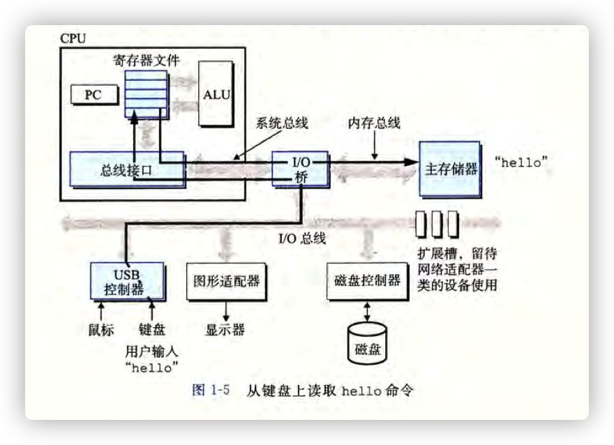
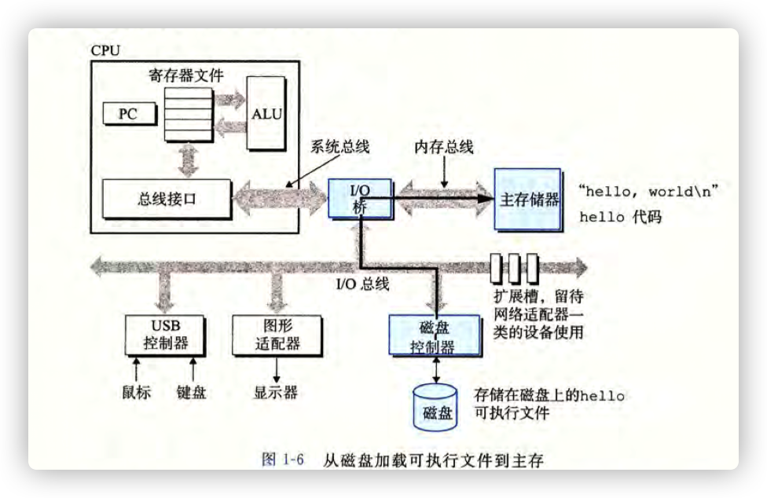

# hello 程序运行分析

## 操作描述与结果显示

打开命令行，命令行等待我们输入一个命令，当我们在键盘上键入"./hello"并且回车之后，屏幕打印出"Hello,Wolrd"

## 实质分析

当我们在键盘键入的时候，实际就是在使用 IO 设备(键盘)在进行输入

I/O 设备->CPU->主存

当我们敲回车的时候，程序知道我们结束了输入

Shell 执行一系列的指令来加载 Hello 文件，这些指令将 Hello 文件中的代码和数据从磁盘复制到主存中

在用户操作完成之后，屏幕打印出"Hello,World"

处理器开始执行 main 程序中机器语言指令，这些指令将"hello,world\n"复制到寄存器文件，再从寄存器复制到显示设备，显示在屏幕上
